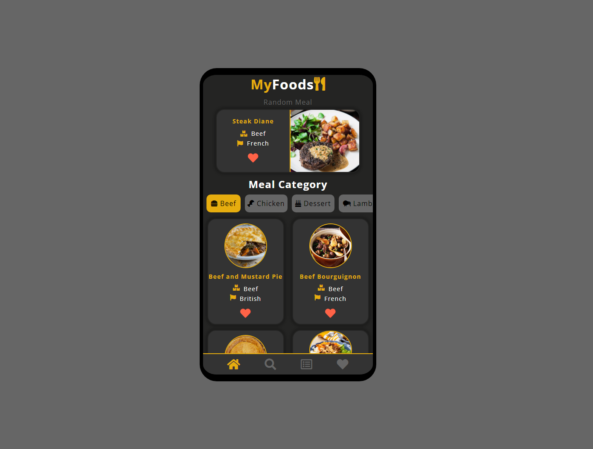

# My Foods app

This is not your typical recepie app. 

My Foods will help you to look for your next delicious meal! Search your meals based on their category or the country of provenience. 

The search page will allow you to search meals by their name.

When you find your favourite meals you can save them to your favourites page by clicking on the heart.

This app is currently only for mobile devices.

---

Technologies used:

1. **HTML**
2. **CSS**
3. **VANILLA JAVASCRIPT**

This project was built in an **OOP** (object oriented programming) style. 

Data was retrieved from a public api [TheMealDB](https://www.themealdb.com/api.php).

I used **async/await** together with **fetch** to grab the data from the api. Favourite meals are persisted to **local storage**. High order functions have been used to iterate through data. There is a lot of **DOM manipulation** and **event listeners**. **CSS animation** was used to animate the heart on click. The page colors are stored in **CSS variables**.

[View Project](https://philiphinch.github.io/my-foods-app/)

---

---

[View Project](https://philiphinch.github.io/my-foods-app/)
